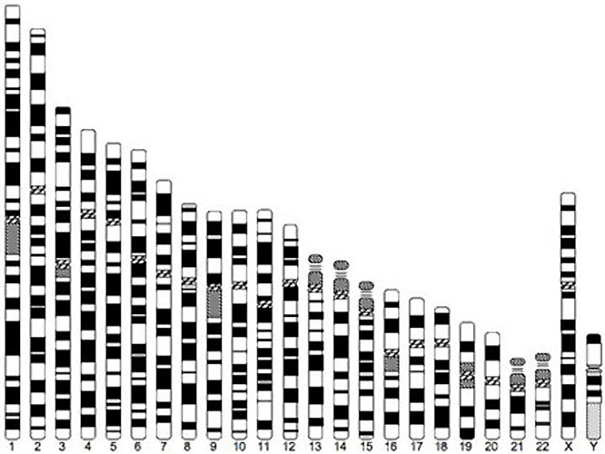
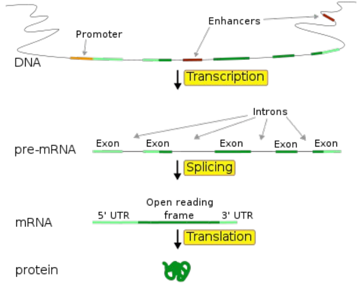

```{r style, echo = FALSE, results = 'asis'}
knitr::opts_chunk$set(
    eval=as.logical(Sys.getenv("KNITR_EVAL", "TRUE")),
    cache=as.logical(Sys.getenv("KNITR_CACHE", "TRUE"))
)
```

```{r setup, echo=FALSE}
suppressPackageStartupMessages({
    library(S4Vectors)
    library(DelayedArray)
    library(TxDb.Hsapiens.UCSC.hg38.knownGene)
    library(rhdf5)
    library(HDF5Array)
    library(TENxBrainData)
})
```

```{r, echo = FALSE}
genes <- function(...) {
    gn <- GenomicFeatures::genes(...)
    gn <- unname(keepStandardChromosomes(gn, pruning.mode="coarse"))
    gn[order(seqnames(gn), strand(gn), start(gn))]
}

exonsBy <- function(...) {
    ex <- GenomicFeatures::exonsBy(...)
    keepStandardChromosomes(ex, pruning.mode="coarse")
}
```

# Data types

Defined in the [S4Vectors][] and other packages

- Base classes provide standard API
- `length()`
- `[`, `[<-` (endomorphic)
- `[[`, `[[<-`

Scenario


<br />From: https://embryology.med.unsw.edu.au/embryology/images/2/23/Human_idiogram.jpg

- 10k - millions of genomic coordinates
- Sequence (chromosome) name, strand, start and end positions
- Constraints, e.g., start <= end

_Bioconductor_ annotation packages

```{r}
library(TxDb.Hsapiens.UCSC.hg38.knownGene)
gn <- genes(TxDb.Hsapiens.UCSC.hg38.knownGene)
gn
```

## Run-length encoding

- Chromosome name, strand; factor-Rle's
- `Vector` API
- Original motivation probably storage efficiency.
- Confusing for end users
- Doesn't play well with standard data representations (e.g., `data.frame()`)

```{r}
seqnames(gn)
length(seqnames(gn))
seqnames(gn)[1:100]
data.frame(x = head(seqnames(gn)))$x
```

## List-of-type


<br />From: https://www.ebi.ac.uk/training/online/sites/ebi.ac.uk.training.online/files/u1218/Core5.pdf

- Many small groups, e.g., 182,000 transcripts each with 1 - 10's of exons.
- Represent groups as, e.g., list-of-integers
- Element-wise operations, e.g., `>`

    ```{r}
    ex <- exonsBy(TxDb.Hsapiens.UCSC.hg38.knownGene, "tx")
    width(ex)
    width(ex) > 400
    ex[width(ex) > 400]
    ```

- Element-wise reductions, e.g., `sum()`

    ```{r}
    head(sum(width(ex)))
    hist(log(sum(width(ex))))
    ```

- Expressive and efficient for users, though new concepts required.
- Implementation as 'unlisted' data and partitioning

    ```{r}
    slotNames(class(width(ex)))
    ```
- Inexpensive to unlist, transform, relist

    ```{r}
    relist(unlist(width(ex), use.names=FALSE) > 400, ex)
    ```

## DataFrame

- Anything with `length()`, `[`, `[<-` -- the `Vector` API.

    ```{r}
    DataFrame(n = lengths(ex), widths=width(ex))
    ```

# Out-of-memory computation

Developed in the [DelayedArray][] and related packages

Scenario

- 'Single cell' sequencing generates measures of expression of 30,000 genes across 10's of thousands of cells
- Poster child -- 10x Genomics 'million cell' data set -- 27998 genes by 1306127 cells
- Large but sparse, e.g., 85 - 95% zeros.

## On-disk representations, e.g., HDF5

- 10x distributes their data in HDF5

    ```{r}
    library(rhdf5)
    fl <- "~/.ExperimentHub/1039"
    h5ls(fl)
    ```

- We represent it as a 'matrix'

    ```{r}
    library(DelayedArray)
    tenx <- TENxMatrix(fl)
    tenx
    ```

- Operations on the matrix are 'delayed' -- only the visible elements are actually computed / in memory

    ```{r}
    log(tenx + 1)
    ```

- There is a parse tree

    ```{r}
    t(log(tenx + 1) * tenx)@seed
    ```

- Sparseness (and other properties) propagate (n.b., sparseness is not based on a heursitic, but rather rule-based

    ```{r}
    is_sparse(tenx)
    is_sparse(tenx + 1)
    is_sparse(log(tenx + 1))
    ```

- Eventually, realization occurs via block processing, possibly in parallel


    ```{r}
    mean(colSums(tenx[,1:100] > 0) / nrow(tenx))
    tenx1 <- writeTENxMatrix(log(tenx + 1)[,1:5000], tempfile(), verbose=TRUE)
    tenx1
    h5ls(path(tenx1))
    ```

- The `tenx` object obeys a 'matrix' API, e.g., 2-D `[`, `dimnames()`, `dim()` so can be used in other objects that expect a matrix

    ```{r}
    library(SummarizedExperiment)
    SummarizedExperiment(tenx)
    ```

## Remote computation

- The following creates an object that acts like a familiar 'SummarizedExperiment'

    ```{r, eval = FALSE}
    library(SummarizedExperiment)
    library(BiocOncoTK)   # uses restfulSE
    bq = pancan_BQ()      # need CGC_BILLING
    seCOAD = bindMSI(buildPancanSE(bq, acronym="COAD", assay="RNASeqv2"))
    ```

- `[` and `assay()` translate to remote SQL-like queries evalauted on Google BigTable data maintained by others.

    ```{r, eval = FALSE}
    > assay(seCOAD["29126",])
    <1 x 220> DelayedMatrix object of type "double":
    Running job [/]  2s
    Complete
    Billed: 8.79 GB
    Downloading 4 rows in 1 pages.
      	TCGA-CK-5916 TCGA-CK-5912 ... TCGA-AA-3662 TCGA-AA-3660
    29126  	73.8999   	7.9840   .      45.5696  	13.0435
    ```

# Acknowledgements

People

- [S4Vectors][]: Herve Pagès, Michael Lawrence, Patrick Aboyoun
- [DelayedArray][]: Herve Pagès; [rhdf5][] / [Rhdf5lib][]: Mike Smith. 
- Significant motivation: Aaron Lun.

Funding

- Research reported in this presentation was supported by the National Human Genome Research Institute and the National Cancer Institute of the National Institutes of Health under award numbers U41HG004059 and U24CA180996. The content is solely the responsibility of the authors and does not necessarily represent the official views of the National Institutes of Health.


[S4Vectors]: https://bioconductor.org/packages/devel/S4Vectors
[DelayedArray]: https://bioconductor.org/packages/devel/DelayedArray
[rhdf5]: https://bioconductor.org/packages/devel/rhdf5
[Rhdf5lib]: https://bioconductor.org/packages/devel/Rhdf5lib
